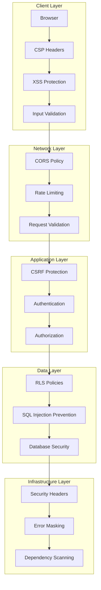

# Security Audit Design Document

## Overview

This design document outlines the comprehensive security architecture for the Nyumba Link application. The design addresses critical security vulnerabilities identified in the audit, including XSS protection, CSRF prevention, authentication security, rate limiting, and database security hardening. The solution follows defense-in-depth principles with multiple layers of security controls.

## Architecture

### Security Layer Architecture



### Security Control Matrix

| Layer | Control | Implementation | Priority |
|-------|---------|----------------|----------|
| Client | XSS Protection | CSP, Input Sanitization | High |
| Network | CORS Policy | Strict Origin Control | High |
| Application | CSRF Protection | Token-based Validation | High |
| Data | SQL Injection | Parameterized Queries | Critical |
| Infrastructure | Security Headers | Comprehensive Header Set | Medium |

## Components and Interfaces

### 1. Enhanced XSS Protection System

**Component:** `XSSProtectionService`

**Interface:**
```typescript
interface XSSProtectionService {
  sanitizeInput(input: string, context: 'html' | 'attribute' | 'url'): string;
  validateCSP(nonce: string): boolean;
  generateSecureNonce(): string;
  isAllowedDomain(url: string): boolean;
}
```

**Implementation Strategy:**
- DOMPurify integration for HTML sanitization
- Context-aware sanitization (HTML, attributes, URLs)
- CSP nonce generation and validation
- Whitelist-based domain validation
- Real-time XSS pattern detection

### 2. CSRF Protection Framework

**Component:** `CSRFProtectionFramework`

**Interface:**
```typescript
interface CSRFProtectionFramework {
  generateToken(): string;
  validateToken(token: string, storedToken: string): boolean;
  addTokenToRequest(request: RequestInit): RequestInit;
  rotateToken(): void;
  clearTokens(): void;
}
```

**Implementation Strategy:**
- Cryptographically secure token generation
- Constant-time token comparison
- Automatic token rotation
- Session-based token storage
- Request header integration

### 3. Advanced Rate Limiting Engine

**Component:** `RateLimitingEngine`

**Interface:**
```typescript
interface RateLimitingEngine {
  checkLimit(identifier: string, action: string): Promise<RateLimitResult>;
  incrementCounter(identifier: string, action: string): Promise<void>;
  resetCounter(identifier: string, action: string): Promise<void>;
  getTimeToReset(identifier: string, action: string): Promise<number>;
}
```

**Implementation Strategy:**
- Sliding window algorithm
- Redis-based distributed rate limiting
- Per-user and per-IP limiting
- Action-specific rate limits
- Progressive penalty system

### 4. Secure Authentication Manager

**Component:** `SecureAuthManager`

**Interface:**
```typescript
interface SecureAuthManager {
  rotateTokens(userId: string): Promise<TokenPair>;
  validateTokenSecurity(token: string): SecurityValidationResult;
  detectSuspiciousActivity(userId: string, context: AuthContext): Promise<boolean>;
  enforcePasswordPolicy(password: string): PasswordValidationResult;
  checkCompromisedPassword(password: string): Promise<boolean>;
}
```

**Implementation Strategy:**
- Automatic token rotation
- JWT security validation
- Behavioral analysis for suspicious activity
- HaveIBeenPwned integration
- Progressive authentication delays

### 5. Database Security Hardener

**Component:** `DatabaseSecurityHardener`

**Interface:**
```typescript
interface DatabaseSecurityHardener {
  optimizeRLSPolicies(): Promise<void>;
  setSecureSearchPaths(): Promise<void>;
  consolidatePermissivePolicies(): Promise<void>;
  enableSecurityFeatures(): Promise<void>;
}
```

**Implementation Strategy:**
- RLS policy optimization with subqueries
- Secure search path configuration
- Policy consolidation for performance
- Security feature enablement

## Data Models

### Security Configuration Model

```typescript
interface SecurityConfig {
  xss: {
    enableCSP: boolean;
    allowedDomains: string[];
    nonceLength: number;
    sanitizationLevel: 'strict' | 'moderate' | 'permissive';
  };
  csrf: {
    tokenLength: number;
    rotationInterval: number;
    storageType: 'session' | 'memory';
  };
  rateLimit: {
    windowSize: number;
    maxRequests: number;
    penaltyMultiplier: number;
    actions: Record<string, RateLimitConfig>;
  };
  auth: {
    tokenRotationInterval: number;
    maxFailedAttempts: number;
    lockoutDuration: number;
    passwordPolicy: PasswordPolicy;
  };
}
```

### Security Event Model

```typescript
interface SecurityEvent {
  id: string;
  timestamp: Date;
  type: 'xss_attempt' | 'csrf_violation' | 'rate_limit_exceeded' | 'auth_failure';
  severity: 'low' | 'medium' | 'high' | 'critical';
  source: {
    ip: string;
    userAgent: string;
    userId?: string;
  };
  details: Record<string, any>;
  blocked: boolean;
}
```

### Rate Limit State Model

```typescript
interface RateLimitState {
  identifier: string;
  action: string;
  count: number;
  windowStart: Date;
  windowEnd: Date;
  blocked: boolean;
  penaltyLevel: number;
}
```

## Error Handling

### Security Error Classification

```typescript
enum SecurityErrorType {
  XSS_DETECTED = 'XSS_DETECTED',
  CSRF_VIOLATION = 'CSRF_VIOLATION',
  RATE_LIMIT_EXCEEDED = 'RATE_LIMIT_EXCEEDED',
  AUTH_TOKEN_INVALID = 'AUTH_TOKEN_INVALID',
  SUSPICIOUS_ACTIVITY = 'SUSPICIOUS_ACTIVITY',
  INPUT_VALIDATION_FAILED = 'INPUT_VALIDATION_FAILED'
}
```

### Error Masking Strategy

**Production Error Responses:**
- Generic error messages for security violations
- Unique error IDs for tracking
- Detailed logging for security team
- No sensitive information exposure

**Development Error Responses:**
- Detailed error information
- Stack traces for debugging
- Security violation details
- Performance impact metrics

### Security Incident Response

```typescript
interface SecurityIncidentResponse {
  detectThreat(event: SecurityEvent): ThreatLevel;
  escalateIncident(incident: SecurityIncident): void;
  blockSource(source: SecuritySource): void;
  notifySecurityTeam(incident: SecurityIncident): void;
  generateReport(timeRange: DateRange): SecurityReport;
}
```

## Testing Strategy

### Security Testing Framework

**1. Automated Security Testing**
- XSS payload injection tests
- CSRF token validation tests
- Rate limiting boundary tests
- SQL injection prevention tests
- Authentication bypass attempts

**2. Penetration Testing Scenarios**
- Cross-site scripting attacks
- Cross-site request forgery
- Brute force authentication
- Session hijacking attempts
- Input validation bypasses

**3. Security Regression Testing**
- Automated security test suite
- Continuous security scanning
- Dependency vulnerability checks
- Configuration drift detection

### Test Data Security

**Sensitive Data Handling:**
- Test data anonymization
- Secure test environment isolation
- Production data protection
- Test credential management

### Performance Impact Testing

**Security Control Performance:**
- Rate limiting overhead measurement
- XSS sanitization performance
- CSRF token validation speed
- Database security query impact

## Implementation Phases

### Phase 1: Critical Security Fixes (Week 1)
- XSS protection implementation
- CSRF token framework
- Basic rate limiting
- Security headers configuration

### Phase 2: Authentication Security (Week 2)
- Token rotation mechanism
- Password security enhancement
- Suspicious activity detection
- Authentication rate limiting

### Phase 3: Database Security (Week 3)
- RLS policy optimization
- Search path security
- Policy consolidation
- Security feature enablement

### Phase 4: Advanced Protection (Week 4)
- Advanced rate limiting
- Security monitoring
- Incident response system
- Dependency scanning automation

## Security Monitoring and Alerting

### Real-time Security Monitoring

```typescript
interface SecurityMonitor {
  trackSecurityEvents(events: SecurityEvent[]): void;
  detectAnomalies(baseline: SecurityBaseline): Anomaly[];
  generateAlerts(threats: Threat[]): Alert[];
  updateThreatIntelligence(intelligence: ThreatIntelligence): void;
}
```

### Security Metrics Dashboard

**Key Security Metrics:**
- XSS attempts blocked per hour
- CSRF violations detected
- Rate limit violations by endpoint
- Authentication failure rates
- Database security policy violations

### Automated Response System

**Response Actions:**
- Automatic IP blocking for severe violations
- User account temporary suspension
- Rate limit adjustment based on threat level
- Security team notification for critical events

## Compliance and Standards

### Security Standards Compliance

**OWASP Top 10 Coverage:**
- A01: Broken Access Control ✓
- A02: Cryptographic Failures ✓
- A03: Injection ✓
- A04: Insecure Design ✓
- A05: Security Misconfiguration ✓
- A06: Vulnerable Components ✓
- A07: Authentication Failures ✓
- A08: Software Integrity Failures ✓
- A09: Security Logging Failures ✓
- A10: Server-Side Request Forgery ✓

### Data Protection Compliance

**GDPR Considerations:**
- User data encryption
- Right to be forgotten implementation
- Data breach notification procedures
- Privacy by design principles

## Performance Considerations

### Security vs Performance Balance

**Optimization Strategies:**
- Caching of security validations
- Asynchronous security checks
- Efficient rate limiting algorithms
- Optimized database security queries

### Scalability Planning

**Horizontal Scaling:**
- Distributed rate limiting with Redis
- Load balancer security configuration
- Session management across instances
- Security event aggregation

## Future Enhancements

### Advanced Security Features

**Planned Enhancements:**
- Machine learning-based threat detection
- Behavioral analysis for user authentication
- Advanced bot detection and mitigation
- Zero-trust architecture implementation

### Security Automation

**Automation Opportunities:**
- Automated security patch management
- Dynamic security policy adjustment
- Intelligent threat response
- Continuous security assessment